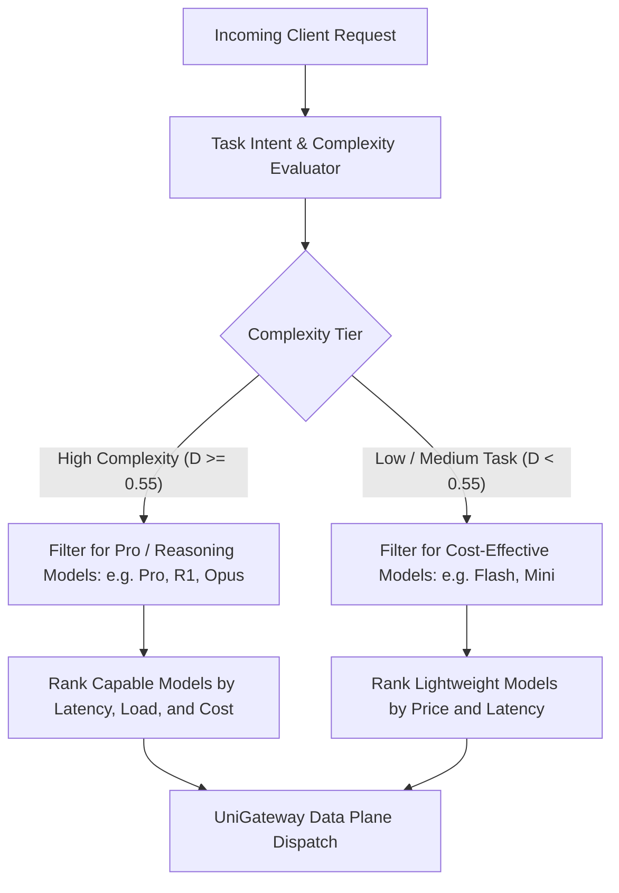

# Intelligent Model Routing & Capability Gating

This document outlines SmartGate's **Capability-Aware Routing (`capability_aware`)** architecture, task complexity scoring system, and two-stage gating model.

---

## 1. Core Architecture: Two-Stage Gating & Strategy-Based Optimization

Rather than naively adding raw monetary cost and capability into a single linear formula, SmartGate uses a **two-stage gating architecture**:

### Decision Pipeline
1. **Stage 1 (Capability Hard Gate)**:
   - When request difficulty $D \ge \text{Threshold}$, lightweight models are filtered out from the primary slot, subject to health and fallback policy.
   - Simple tasks may be routed to lightweight models (Flash / Mini). Cost and quality impact must be validated with the offline evaluation set before making savings claims.
2. **Stage 2 (Strategy Ranking & Fallback)**:
   - Within the qualified capability set, the configured control-plane strategy ranks candidates using the signals supported by that strategy, including capability, model family, cost, active connections, latency, and health.
   - UniGateway executes the resulting candidate order and falls back when the primary model encounters a retryable error.

---

## 2. Multi-Tier Complexity Detection System

SmartGate computes a normalized task difficulty $D \in [0.0, 1.0]$ using three layers of heuristic signals. Runtime and routing-quality claims require benchmark evidence.

| Tier | Evaluation Signals | Rules & Indicators | Latency |
| :--- | :--- | :--- | :--- |
| **L1: Static Structure** | Token length, code markers, schemas and tools | • Prompt length, code fences, selected structural markers • Tool definitions and conversation size | Implementation-dependent; benchmark required |
| **L2: Semantic Intent** | Domain concepts and reasoning keywords | • **High ($D \ge 0.55$)**: Formal proofs, distributed consensus (Raft/Paxos), lock-free algorithms, kernel design, quantum computing • **Low ($D < 0.35$)**: Greeting, single-phrase translation, formatting, regex, entity extraction | Implementation-dependent; benchmark required |
| **L3: Multi-Turn Context** | Conversation depth and feedback cues | • Conversation rounds and corrective/error cues • Tool-call error traces can increase the heuristic score | Implementation-dependent; benchmark required |

---

## 3. Auxiliary Judge Model (Optional Extension)

For ambiguous prompts where heuristic signals fall into a borderline zone ($0.30 \le D \le 0.65$), administrators can optionally enable an **Auxiliary Judge Model** on the Model Pool:

- **Gated Execution**: Only triggered for borderline queries to minimize latency and token overhead.
- **Micro-Prompt Classification**: Invokes a fast, cheap model (e.g. Flash/Mini) with a single-token binary output (`COMPLEX` vs `SIMPLE`).
- **Circuit Breaker**: Bounded by a strict 250ms timeout. The judge request is dispatched through UniGateway, so provider protocol rendering, credentials, endpoint health, usage reporting, and retry behavior stay in the data plane. If the judge times out or errors, SmartGate gracefully defaults to the heuristic score without impacting user experience.
