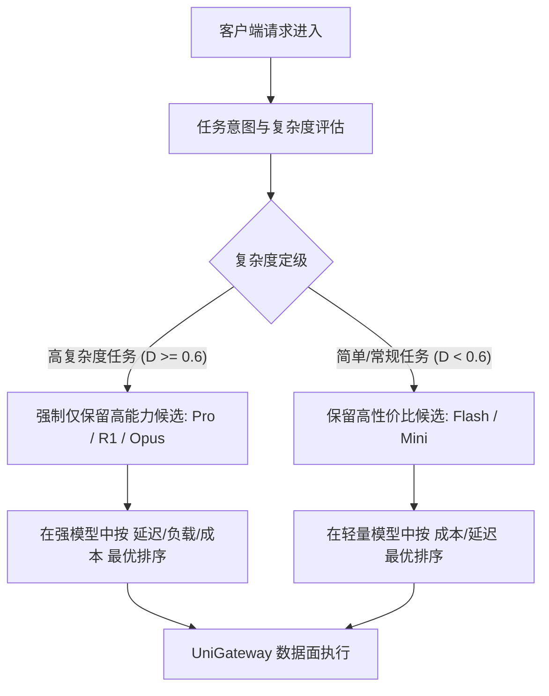
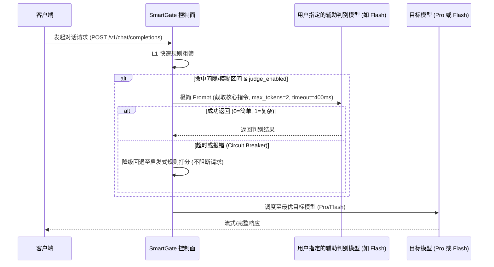

# 智能模型路由与任务复杂度判别优化方案

本文档针对模型池在「能力感知路由（`capability_aware` / Capability-first routing）」下高能力模型（如 Pro）未被合理调度的根因进行分析，并提出一套兼顾**高智能、低延迟、可控成本**的两阶段智能路由架构。

---

## 1. 背景与现状分析

### 1.1 现存问题
在包含不同能力梯度模型（如 `deepseek-v4-flash`、`qwen3.6-flash`、`deepseek-v4-pro`）的模型池中：
1. **价格权重淹没能力加分**：底层打分将能力分层（Tier 1/2）与单次成本得分（$1.0 / \text{Cost}$）直接相加。因为 Flash 模型单价极低，其成本得分（可达数万分）直接覆盖了 Pro 模型的层级加分（最高 2,000 分），导致即使在复杂任务下 Flash 依然被排在首位。
2. **能力评分依赖手动配置**：若用户未手动为各 Endpoint 配置精细的 `capability_score`（默认为 0.5），系统会判定所有模型能力相同，完全退化为按价格排序。
3. **任务复杂度判断维度单一**：仅依赖 Prompt 长度、代码块和 Tools 进行粗粒度打分，无法精准识别深层逻辑推理、数学证明、架构设计与日常短聊的差异。

---

## 2. 核心设计：两阶段「能力门槛过滤 + 帕累托最优」

彻底废弃“能力 + 成本”的线性混合加权公式，转为 **双阶段门槛分流**：



### 决策机制
1. **阶段一（能力硬门槛）**：
   - 当请求难度 $D \ge \text{Threshold}$ 时，自动将低能力模型移出首选候选集，确保 100% 由强模型（Pro/Reasoning）承接；
   - 简单任务由低成本模型承接，避免强模型资源的算力与成本浪费。
2. **阶段二（同层择优与 Fallback）**：
   - 在已满足能力门槛的模型集合内，根据实际单价与实时延迟进行 Pareto 排序；
   - 若高能力模型发生限流（429）或故障（5xx），自动 Fallback 至备选模型并记录指标。

---

## 3. 任务复杂度判别体系

为实现精准判别，设计 **三层特征识别体系**：

| 层级 | 识别维度 | 判定指标与规则 | 处理延迟 |
| :--- | :--- | :--- | :--- |
| **L1: 结构与静态特征** | Token 长度、代码密度、工具定义 | • Token > 6,000 或带有完整源码工程上下文<br>• 包含复杂 AST、SQL 嵌套、正则与多层 JSON Schema<br>• 包含多个复杂 Tool Call 定义与依赖 | $< 0.1\text{ ms}$ |
| **L2: 语义意图识别** | 任务领域与指令模式 | • **高难度**：定理证明、架构设计分析、根因排查、多步规划<br>• **低难度**：日常闲聊问候、单语翻译、文本润色、单字段提取 | $< 1\text{ ms}$ |
| **L3: 多轮交互动态** | 历史对话深度与纠错反馈 | • 用户多轮纠错信号（如“不对/有报错/遗漏了边界条件”）<br>• Tool 连续执行报错堆栈回传 $\rightarrow$ 触发自动升舱到强模型 | $< 0.1\text{ ms}$ |

---

## 4. 进阶演进：基于模型判别（LLM-as-a-Router）与成本权衡

在规则无法明确归类的边缘场景下，引入轻量模型进行决策，同时通过**分级过滤机制**控制延迟与成本。

### 4.1 分级触发架构（Gated Router）

```mermaid
flowchart TD
    Req[客户端请求] --> L1Check[0 延迟规则通道]
    
    L1Check -- 一眼可辨的极简任务 (约 50%) --> Flash[直通 Flash 模型 (0 额外开销)]
    L1Check -- 一眼可辨的高难任务 (约 25%) --> Pro[直通 Pro 模型 (0 额外开销)]
    
    L1Check -- 灰色模糊地带 (约 25%) --> Judge[触发微型判别器]
    
    Judge -- 判定简单 --> Flash
    Judge -- 判定复杂 --> Pro
```

### 4.2 判别实现方案对比与成本权衡

| 方案 | 实现方式 | 延迟影响 | 成本开销 | 适用场景 |
| :--- | :--- | :--- | :--- | :--- |
| **本地微型分类模型** | 网关常驻 0.5B ~ 1B 蒸馏微型模型或 BERT 分类头，仅输出 1 个分类 Token | $5 \sim 15\text{ ms}$ (本地 CPU/GPU) | $\approx \$0$ | 高并发生产环境 |
| **云端 API 辅助判别模型** *(用户可配)* | 允许用户指定一个便宜/超快模型（如自身拥有的 Flash/Mini 模型）作为决策辅助 | $120 \sim 250\text{ ms}$ | $\approx \$0.00002 / \text{次}$ | SaaS 与通用云端部署 |

### 4.3 用户自定义「辅助判别模型（Auxiliary Judge Model）」配置方案

为了给用户最大的自主性与透明度，在 Model Service（模型服务）的高级路由配置中提供 **辅助判别模型** 选项：

#### 1. 产品交互与配置项 (UI & Data Model)
- **启用模型辅助判别 (`judge_enabled`)**：开关，默认在 `capability_aware` 下可选开启。
- **选择辅助判别模型 (`judge_endpoint_id`)**：
  - 下拉框列出当前池中（或组织内已添加的）低单价/极速模型（如 `deepseek-v4-flash`、`qwen3.6-flash`、`gpt-4o-mini` 等）。
- **判别触发策略 (`judge_trigger_mode`)**：
  - `gated` *(推荐默认)*：仅在启发式规则判定难度处于中间灰色区间（如 $0.35 \le D \le 0.70$）时触发，最大化节约延迟与 Token；
  - `always`：对所有非缓存请求均进行模型判别。

#### 2. 执行机制与熔断保护

- **超时与熔断机制**：辅助判别调用设置严格的超时阈值（如 $300 \sim 400\text{ ms}$），一旦判别模型发生超时、限流或不可用，网关自动静默降级为启发式规则，**绝不影响客户端正常请求的成功率**。

---

## 5. 自动模型能力画像预设

减少用户手动配置参数的认知负担，网关内置主流模型基准能力画像库：

```json
{
  "deepseek-reasoner": { "tier": 1, "capability": 0.96, "tags": ["reasoning", "math", "code"] },
  "deepseek-v4-pro":   { "tier": 1, "capability": 0.92, "tags": ["code", "complex_chat"] },
  "claude-3-5-sonnet": { "tier": 1, "capability": 0.95, "tags": ["code", "reasoning", "tools"] },
  "deepseek-v4-flash": { "tier": 2, "capability": 0.65, "tags": ["fast", "cost_efficient"] },
  "qwen3.6-flash":     { "tier": 2, "capability": 0.62, "tags": ["fast", "cost_efficient"] }
}
```
- 添加已知模型时自动填充能力基准；
- 用户仍可在高级选项中覆盖微调。

---

## 6. 落地实施路线图

1. **阶段一（内核公式与阈值修复）**：
   - 修复控制面 `src/routing/strategy.rs` 中的 `capability_aware` 打分逻辑，重构为两阶段门槛分流；
   - 增加主流模型默认画像字典，解决 Pro 与 Flash 得分倒挂。
2. **阶段二（用户自定义辅助判别模型）**：
   - 在 Model Service 配置中支持用户指定 `judge_endpoint_id`；
   - 实现轻量截断 Prompt 判别与 $400\text{ ms}$ 熔断降级兜底机制。
3. **阶段三（多维规则与多轮感知增强）**：
   - 完善 Prompt 意图关键词提取与多轮纠错信号检测（用户反驳/报错即刻升舱）。

---

## 7. 实施进展与补充根因

阶段一已落地，并在排查「高复杂度请求仍 100% 命中 Flash」时定位到另外三条根因。

### 7.1 打分公式：能力优先，价格只做同档破平（已修复）

`capability_aware` 在 $D \ge 0.55$ 时改为分层排序：能力档（Tier）> 能力分（每 0.01 一档）> 单次成本；
$D < 0.55$ 时保持成本优先（够用就选便宜）。成本项上限被压到严格小于一个能力档，避免 Flash 的低价再次淹没 Pro 的能力优势。

此前即使有 Tier 加分，只要 Pro 与 Flash 落在同一 Tier（例如能力分被配成接近值，或都通过门槛），成本项仍会让 Flash 胜出。

### 7.2 请求级 hint 串扰（已修复）

控制面把 `RouteHint`（含 difficulty）同时写入 task-local 与共享 `DashMap`，而反馈打分**优先读共享 map**。
并发场景下（Claude Code / Codex 会并行发起大量小请求），一个简单请求写入的低 difficulty 会决定同一 Pool 上复杂请求的路由，
表现为「Analytics 记录 100% 高复杂度，实际 100% 命中 Flash」。现改为优先读取本请求的 task-local hint，共享 map 仅作兜底。

### 7.3 预算 soft gate 会排除唯一强模型（已修复）

日额度用满 80% 后进入 soft 降级，会排除成本高于中位数 5% 的 Endpoint。
在高复杂度请求上，这会把唯一满足能力门槛的 Pro 排除，使复杂任务被静默降级。
现在 $D \ge 0.55$ 时能力合格集合不受预算 soft gate 排除（hard 阻断仍然生效）。

### 7.4 能力分并列时按模型家族破平（已修复）

线上 `fusion` 的实际配置是 `deepseek-v4-flash` 与 `deepseek-v4-pro` 都被写成 `capability_score = 0.80`。
两者能力分完全相同，排序只能落到价格，Flash 必然胜出——这与 7.1 的公式修复无关，因为公式没有可用的能力差可比。

现在 Endpoint 画像额外携带 **模型家族能力分**（由 `upstream_model_id` 推断），高难度排序键为：
能力档（配置值，每 0.01 一档）> 家族画像档 > 单次成本。
配置值相同时由家族画像决定（Pro 0.92 > Flash 0.65）；若用户刻意把 Flash 配得更高，则仍尊重配置值。

另外当整个 Pool 的配置能力分差 < 0.05 而家族画像差 ≥ 0.05 时，直接改用家族画像并告警。

### 7.5 可观测性

路由决策不应只存在于服务器日志里（Railway 等托管平台的 Deploy Logs 只保留运行期输出，排查历史请求不便）。
控制面在派发前用**与数据面相同的打分**生成候选快照，写入 `usage_logs.routing_decision.candidates`
（endpoint、能力分、预估成本、得分、是否排除与排除原因），Analytics 的 Query Logs 可直接展开「Why this model?」查看排序。

- `smartgate.routing` 日志输出每个候选的能力分、预估成本、得分、是否排除与排除原因（`health` / `tools_unsupported` / `budget_downshift`）；
- `usage_logs.metadata` 记录 `attempts`、`attempt_count` 与 `fallback`，用于区分「未选中 Pro」与「选中 Pro 但上游失败后回退 Flash」；
- Model Service 的 Provider 卡片显示能力分，便于发现能力画像配置错误。
