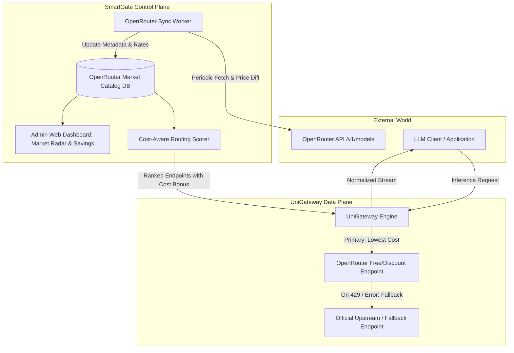

# Design Document: OpenRouter Market Analysis & Dynamic Discount Routing

## 1. Executive Summary

[OpenRouter](https://openrouter.ai/) aggregates hundreds of upstream AI model providers and hosted variants. Due to intense competitive dynamics and provider sponsorships, OpenRouter regularly offers:
1. **100% Free / Sponsored Models** (e.g. `:free` endpoints, promotional zero-token-cost tiers).
2. **Deep Dynamic Discounts** (e.g. 50%–90% off compared to original model creator list prices).
3. **Provider Arbitrage Opportunities** (multiple host providers serving the same open-weights architecture with varying token costs, throughput, and context limits).

This document outlines the design for **SmartGate OpenRouter Market Analysis & Dynamic Discount Routing**. SmartGate will continuously ingest, analyze, and benchmark OpenRouter market dynamics on the control plane, surface actionable savings intelligence in the UI, and automatically optimize routing decisions without compromising reliability or quality.

---

## 2. Core Architectural Principles & Boundaries

In accordance with [SmartGate Collaboration Rules](file:///Users/xinference/github/SmartGate/AGENTS.md):
- **Control Plane Ownership (SmartGate)**:
  - OpenRouter public catalog synchronization & price tracking.
  - Discount detection, free-tier radar, and baseline market price benchmarking.
  - Dynamic score adjustments in Cost-Aware & Capability-Aware routing policies.
  - Telemetry aggregation: Realized cost savings vs. official baseline pricing.
  - UI Visualization: OpenRouter Market Hub, Discount Radar, and Quality Benchmark.
- **Data Plane Decoupling (UniGateway)**:
  - UniGateway treats OpenRouter as a standard OpenAI-compatible provider.
  - UniGateway executes requests with normalized header passthrough (`HTTP-Referer`, `X-Title` if configured).
  - UniGateway performs standard retry, fallback, and streaming normalization without hardcoding OpenRouter-specific business entities.

---

## 3. Key Feature Pillars

### 3.1 OpenRouter Market & Discount Radar (Control Plane Sync Worker)
- **Periodic Catalog Ingestion**:
  - Periodically fetches OpenRouter's public model catalog (`https://openrouter.ai/api/v1/models`).
  - Extracts model metadata: `id`, `name`, `context_length`, `pricing` (prompt tokens, completion tokens, request cost, discount indicators), `architecture` (modalities, tokenizer), `top_provider` info, and rate limits.
- **Market Arbitrage & Discount Detection**:
  - Computes discount ratio compared to official provider baselines (e.g., DeepSeek official API vs. OpenRouter DeepSeek variants).
  - Automatically tags endpoints with `:free`, `super-discount (>70%)`, `moderate-discount (30%-70%)`, or `standard`.

### 3.2 Dynamic Cost-Aware Policy Integration
- **Zero-Cost / Discount Route Prioritization**:
  - For Virtual Models configured with Cost-Aware strategy, SmartGate adjusts the candidate endpoint score:
    $$\text{Score}_{\text{cost}}(ep) = \frac{1.0}{1.0 + \text{EffectiveCostPer1M}(ep)}$$
    Zero-cost (`:free`) endpoints receive maximum cost bonus.
- **Reliability & Rate-Limit Guardrails**:
  - Free/discounted tiers frequently encounter concurrency limits (429 Too Many Requests) or higher initial time-to-first-token (TTFT).
  - SmartGate monitors health and failure rates via `EndpointMetric`. If an OpenRouter free endpoint trips rate limits, it enters a temporary cooldown (e.g. 60s) and automatically falls back to secondary paid/official endpoints.

### 3.3 OpenRouter Market Analytics & ROI Dashboard (UI)
- **Market Radar View**:
  - Real-time directory of available free and heavily discounted models on OpenRouter.
  - 1-click binding: Allows operators to import or bind OpenRouter models directly into existing SmartGate Model Pools.
- **Realized Savings Tracker**:
  - Quantifies total dollars saved by utilizing OpenRouter free/discounted routes instead of list-price provider APIs.

---

## 4. System Workflow & Data Flow

---

## 5. Phased Implementation Roadmap

1. **Phase 1: Market Intelligence & Analysis Document (Current)**
   - Complete technical design and market analysis specification.
2. **Phase 2: Database Schema & Background Sync Worker**
   - Migration for OpenRouter market catalog table.
   - Background worker to periodically fetch and analyze `/api/v1/models`.
3. **Phase 3: Routing Engine Integration**
   - Incorporate live dynamic discounts into `cost_aware` and `priority` scoring.
4. **Phase 4: Admin UI & Market Radar**
   - Add OpenRouter Market Radar view in Web console, localized across `en`, `zh`, `ja`, `ko`.
